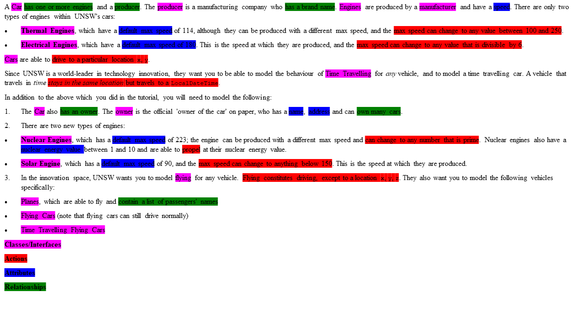
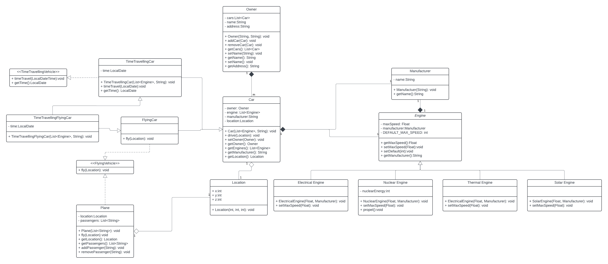

Task 1

Requirements:
Car:

- has one or more engines
- has a manufacturer
- can drive to location x, y
- has an owner

Engine:

- has a speed
- has a manufacturer

Thermal Engine:

- has a default max speed
- can be produced at a different speed
- can change max speed

Electrical Engine:

- has a default max speed
- can be produced at a different speed
- can change max speed

Nuclear Engine:

- has a default max speed
- has a nuclear energy value
- can be produced at a different speed
- can change max speed
- can propel

Solar Engine:

- has a default max speed
- can be produced at a different speed
- can change max speed

Time travelling vehicle:

- can travel to a LocalDate

Time travelling car:

- is a car
- can travel to a LocalDate

Owner:

- has a name
- has an address
- can have multiple cars

Flying Vehicle:

- Can fly to a location x, y, z

Plane:

- has a list of passenger's names
- can fly to a location x, y, z

Flying car:

- is a car
- can fly to a location x, y, z

Time travelling flying car:

- is a flying car
- is a time travelling car

Manufacturer:

- has a name

Task 2

In creating this design tried add as little getters and setter as possible while being keeping all interfaces and classes abstract. For instance, the default speed of all subclasses of engines is not accessible. I also made the engine class abstract as only its subclasses will be instantiated. These subclasses have most of the properties from the engine class and so there is an inheritance relation similar to the time travelling and flying car. The time travelling flying car extends both of the aforementioned classes so it is encapsulated by these two classes. I chose to make flying vehicles and time travelling vehicles an interface to group all of the flying and time travelling methods together. This allows the time travelling flying car use the methods from the time travelling and flying vehicles as well as the car methods hence it is encapsulated within these other classes. I chose to have location as a 3 dimensional position the z axis (height) will be checked to see whether a vehicle can drive (e.g. a flying car cannot drive while being in the air). For the list of passengers I used a remove and add to edit the list of passengers. Other methods can be added using these primitive methods such as empty list etc.

Reflections:
Did you change your mind about your design at any point? How did this change come about?
I changed my mind about adding another subclass to location, the reason was because flying cars existed as vehicles which it would not make sense to have two locations.
Any other things that you thought were interesting / challenging?
It was challenging to think about which attributes I wanted the users to get/set.
