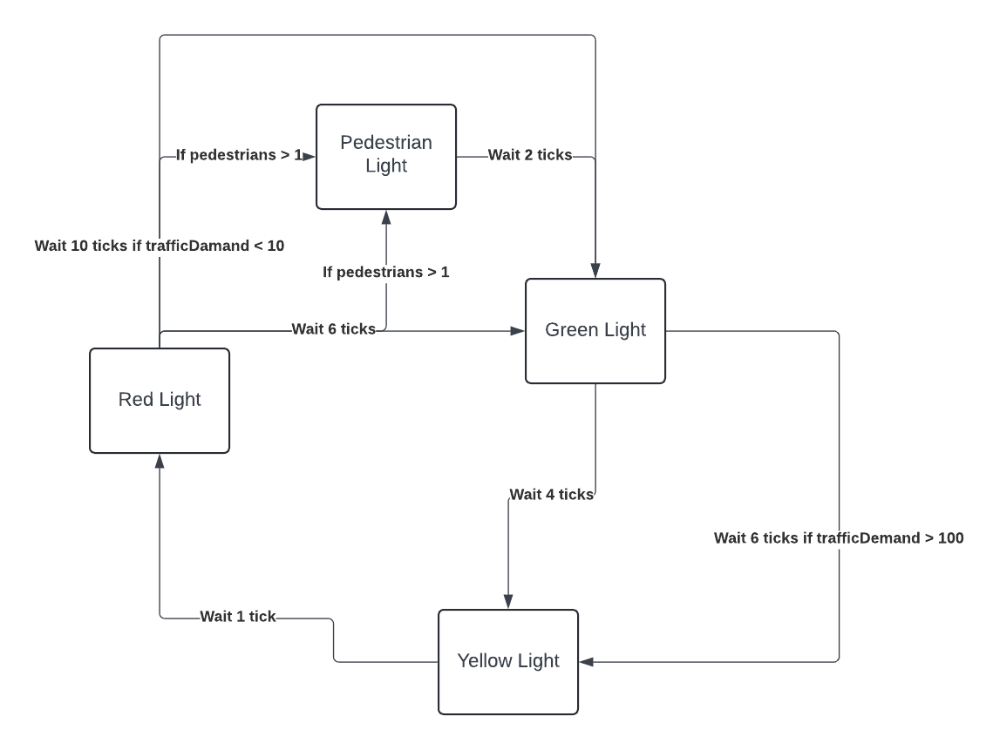

Exercise 1 Task 3
The observer pattern is present with the grapher and panel as the grapher is the thing being observed and when an event happens the panel (the observer) will change. Other implementations of the observer pattern include the panel (the observer) and plot (the observable) and the emitter (the observable) and the plot (observer).

Exercise 2 Task 1
The three states of the traffic lights are:

1.  Red light
2.  Yellow light
3.  Green light

Q1: The orignal code has a lot of if else statements breaks the open closed principles as if statements make extension much more difficult as extending a program will require change all of the if statements. Adding states means that the code is much easier to extend and also does not need to modified, thus it is closed for modification and open for extension.
Q2: The strategy pattern and state patterns are similar however the the strategy pattern is used when there are multiple algorithms for the same task i.e. assigning prices and the client can decide when each strategy is used whereas the state pattern is used when there are different behaviours for each state which tranisition during runtime depending on the current strategy. Since the lights changing depend on the current state and will transition depending on the current strategy, this is an example of a State pattern.

Exercise 3
I think I am going alright in the course - my expectations of my performance in the course has definitely dropped due to the demands and content of the course.

The most difficult thing is understanding the specs but also planning for them. The actual coding is not as difficult but planning solutions and understanding the problem is challenging for me.

I have definitely improved in debugging and being more familiar and competent with java, however time management has been a struggle for me.

I want to improve in planning my solutions for labs.
